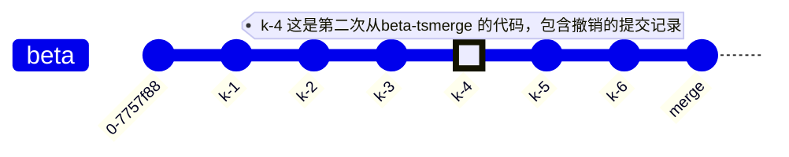
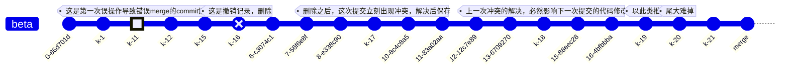
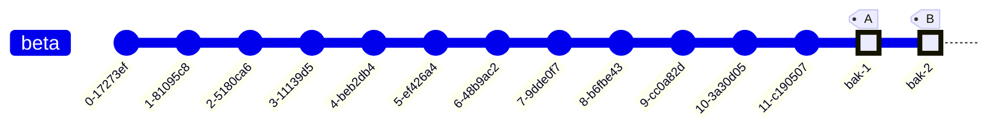

## 背景

在做 KYC(业务) 与 理财(业务) 的迭代开发中，因为两个模块是同时开发的，考虑到可能有一些方法、组件等可能两方都会用到，所以在开发之前，我们约定 **从  beta 分支切出一个 beta-ts 分支，KYC 与 理财 的业务由 beta-ts 各自切出一个分支去开发，当出现KYC 与 理财 共有的组件或方法时，我们将共有的代码在 beta-ts 分支上开发完成，然后分别 merge 到 KYC 与 理财 的迭代分支，业务开发完成之后，再将迭代分支 merge 到 beta 上，进行提测** 

> - 理财和KYC的公共代码在 beta-ts 开发完成后，merge 到 两个业务分支
> - 业务分支开发完成之后 merge 到 beta 提测

``````mermaid
graph TB
  	beta([beta分支])--->beta-ts([beta-ts分支])--->beta-financial(["【beta-financial】理财迭代分支"])
  	beta-ts--->beta-kyc(["【beta-kyc】 KYC迭代分支"])

``````

## 事故

按照上面约定的流程进行开发，正常是不会出现问题的。但是再一次操作中，理财的小伙伴没注意将 `beta-financial` merge 到 `beta-ts` 上了


这就造成了一个问题，当开发 KYC 的小伙伴将 `beta-ts` merge 到 `beta-kyc` 之后，发现自己的分支上出现了 理财 的业务代码，因为理财和KYC并不是同时开发完成，同时提测的，所以这种情况是不被允许的。然后我们在 beta-ts 分支上对那次错误的 merge 进行了撤销，然后重新 merge 到 KYC


如此一来，`beta-ts` 依旧只有公共代码，`beta-kyc` 只有 kyc 代码，`beta-financial` 只有理财代码，一切都好像回到了最初的样子。

## 二次事故

就这样开发了一段时间，又有公共代码了，我们在 `beta-ts` 开发完成之后，再将代码 merge 到 `beta-financial` 分支后，开发理财的小伙伴惊呼，他们的一些代码、图片被删除了

> 由此我们知道 `git` 的撤销操作 (revert) 是将已经添加的代码、图片进行删除，然后再将这些删除操作作为一次 commit 记录进行提交
>
> 所以当 将 `beta-ts`  merge 到 `beta-financial`  时，`beta-financial` 的代码、图片被删除了


然后我们发现撤销是不行的，于是我们将 `beta-ts` 的代码进行了回滚，一路回滚到了错误 merge 之前的代码，然后再将 `beta-ts` 的后几次提交通过cherry-pick 的方式加回来

```sh
$: git reset --hard HEAD^
$: git push -f

$: git cherry-pick t-4
$: git cherry-pick t-6
$: git push
```


如此操作之后，`beta-financial` 分支的代码完全正常，`beta-kyc` 完全正常，`beta-ts` 完全正常，大家相安无事，继续开发

## 第三次事故

从第二次事故解决之后，大家相安无事了很久，KYC 也正常提测了并且也测试通过，具备发布上线的条件了，然后这个时候 `beta-financial` 理财业务准备提测了，还记得我们之前的约定吗，我们提测是将 迭代分支 merge 到 beta 分支进行提测。

在这个时候，我们KYC已经提测过了，但是看一下上面 `beta-kyc` 分支的 **k-4** 记录。我们第二次事故解决的时候，是将 `beta-ts` 的代码进行了回滚，然后将 beta-ts 后面的的commit cherry-pick 追加回来，最后再将 `beta-ts` merge 到 `beta-financial` ，这个样子`beta-ts` 是干净的，它没有撤销记录，所以 merge 到 `beta-financial` 是正常的。

但是我们并没有对 `beta-kyc` 的做任何修改，这就导致 `beta-kyc` 在 **t-4** 依旧保留了原先的删除操作，当他提测 merge 到 `beta` 之后，`beta` 分支也拥有了撤销的commit 记录。


> 执行merge之后，`beta` 分支的 commit 记录就成了这个样子



这就导致当 `beta-financial` 往 `beta` merge 的时候，一些图片被删除了，大量代码存在冲突(在beta上文件已经被删除了，在 `beta-financial` 上，还在文件内做了修改)


因为此，严重影响了理财业务的提测，而此时完整的beta commit 大概是这样


错误merge的commit记录 与 撤销的commit记录，在时间线上已经非常早了，在之后有非常多的正常提交记录，此时发现，再想处理已经非常棘手了

### 尝试解决

既然问题是因为 错误的merge 和 错误的撤销 引起的，那我们将这两次 commit 记录删除就好了，处于保险起见，我们并没有一次性将两个commit记录都删除

我们尝试先删除撤销的commit，撤销的commit清了，之前的merge哪怕保留其实也没关系，因为我们理财的代码也马上就要merge进去了

```sh
$: git rebase -i k-15^
```

然后会进入vim编辑界面


找到我们要删除的commit，然后将前面的 `pick` 修改为 `drop` ，最后保存。

但尝试后我们发现，这样根本行不通，当我们把这次commit删除之后，那意味着原先在撤销之后的commit都会被更早的 merge 所影响，具体的影响是什么呢。

> **背景**
>
> 我们的项目在逐步的开发中，添加了eslint校验，当发现不合理的校验规则的时候也会逐步修正，这就造成早期的代码可能并不符合我们的校验规则；
>
> 我们设置了当git 提交的时候，会进行 eslint 校验
>
> 我们设置了提交的时候，对修改了以及新增的文件进行eslint校验，没有修改的文件不做eslint校验，已保证不会因为早期大量代码不符合规则而造成代码无法提交的问题。
>
> 我们约定，对于早期不符合eslint规则的代码，当提交的时候，遇到了，都去进行做下修正

错误的merge所带来的不仅仅是理财的代码，还有他们提交过的每一次commit，这就导致他们的commit内有对早期文件eslint规则校验不通过的修改，以及一些其他文件的修改。

当这些commit merge 到 `beta-ts` 时，并不会存在问题，因为 `beta-ts` 仅做公共代码的开发，基本不会对早期文件产生影响。

当把 `beta-ts`  merge `beta-kyc` 的时候，因为最后对理财的所有更改撤销了，所以 `beta-ts` => `beta-kyc` 也不会有问题。

但是当把这次撤销的commit删除后，理财与KYC同时修正过的文件，以及可能都有修改文件，就在对后续的每次提交都产生了影响，基本上后续的每一次提交都会出现冲突，我们必须将每一次冲突都解决，才能完全解决这个问题。

此时的情况大概是这样



### 再次尝试解决

试图通过删除commit 记录来解决问题失败了，此时我们开始了第二次尝试。

既然目前出现问题的原因是：**因为撤销操作是对已经添加的文件、代码进行删除，那也就是说问题是因为在时间线上出现了一次删除代码的记录** 

**既然如此，那我们在撤销的时间点之后，人工在创建一个添加代码、文件的commit记录，这样，当代码merge回去的时候，因为在撤销的时间点之后，有了新增的操作，那所以的文件和代码不就回来了。**

基于这个思路，我们从 `beta` 分支新切了一个分支 `beta-bak`，对这个分支的代码进行一路回滚，一直回滚到错误merge之前的时间点，然后将直接用 `beta` 分支的文件覆盖 `beta-bak` 分支的文件，然后提交。

```sh
$: git reset --hard k-10
$: git push -f
$: git checkout beta .
$: git add .
$: git commit -m "xxxxx"
$: git push
```


这样一来，`beta-bak` 和 `beta` 分支的代码完全一致，但是又没有 `beta` 分支的 **merge** 与 **撤销** 的 commit 记录。此时 `beta-bak` 分支的 commit 记录，大概是这样的


- A记录是merge之前的代码
- B记录是最新的提交，相当于新增了 KYC 的代码
- 此时 A 和 B 之间存在大段的空白，没有commit记录

完成了第一步之后，我们再对 `beta-financial` 执行同样的操作，从 `beta-financial` 再切一个分支 `beta-financial-bak`，然后将它的代码回滚到理财开发之前的时间点，然后再用 `beta-financial` 的文件覆盖 `beta-financial-bak` ，此时 `beta-financial` 也是相对干净的

```
$: git reset --hard f-1
$: git push -f
$: git checkout beta-financial .
$: git add .
$: git commit -m "xxxxx"
$: git push
```


- A记录理财开发之前的代码
- B记录理财开发完成之后的代码

这两步都完成之后，我们再将 `beta-financial-bak` merge 到 `beta-bak` ，此时因为有对同样文件的修改，会存在一些冲突，但所有的文件此时都在，冲突我们也仅只需解决一次。

```sh
# 在 beta-bak 执行
$: git merge beta-financial-bak
$: git push
```

如此一来，我们 `beta-bak` 就又创建了一条添加理财代码的 commit 记录，此时我们再将 `beta` 分支 merge 到 `beta-bak`,看下是否还存在冲突，同时`beta-bak` 也有了之前的commit的记录。

```sh
# 在 beta-bak 执行
$: git merge beta
$: git push
```

最后我们将 `beta-bak` merge 回 `beta`

```sh
# 在 beta 执行
$: git merge beta-bak
$: git push
```



A: 重新添加KYC代码的记录

B: 重新添加 理财 代码的记录

**成功解决问题！**

## 最后

1. 每次git操作请认真，看清楚所在分支
2. 约定好的内容请认真执行